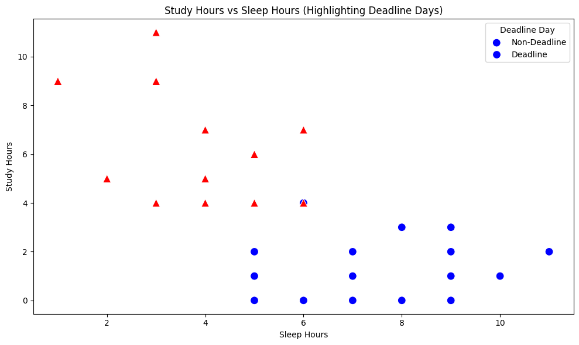
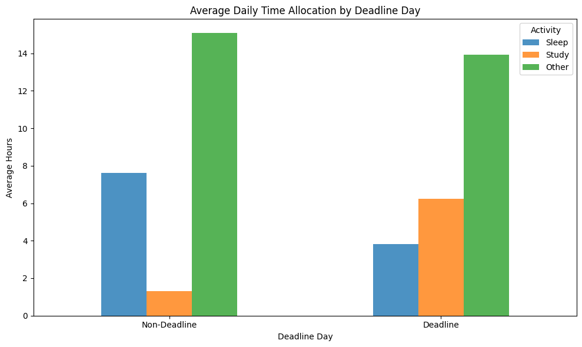
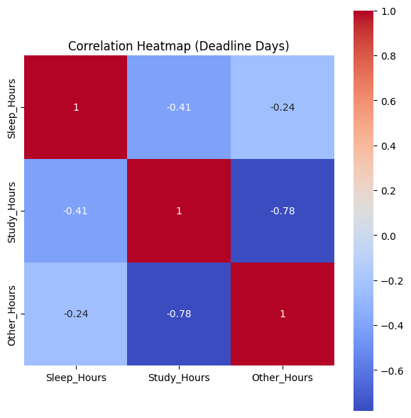

# CS 210 - Fall 2024 - Term Project
# Study Habits Analysis

## Description

This project analyzes my personal study habits by tracking the time I spend studying and sleeping each day. The aim is to gain insights into how I allocate my time through the day, identify patterns, and find areas for improvement.

---

## Table of Contents

- [Motivation](#motivation)
- [Tools](#tools)
- [Data Collection](#data-collection)
- [Data Processing](#data-processing)
- [Data Visualizations](#data-visualizations)
- [Data Analysis](#data-analysis)
  - [Total Study Time](#total-study-time)
  - [Daily Study Patterns](#daily-study-patterns)
  - [Peak Study Hours](#peak-study-hours)
- [Findings](#findings)
- [Limitations and Future Work](#limitations-and-future-work)
  - [Limitations](#limitations)
  - [Future Work](#future-work)
- [Participation in Peer-Evaluation](#participation-in-peer-evaluation)
- [Repository Structure](#repository-structure)
- [Contact](#contact)

---

## Motivation

As a university student striving to graduate, I wanted to understand how effectively I use my time. By analyzing my study habits, I aim to optimize my schedule, focus on problems that need more attention, and improve my overall academic performance. This project is especially relevant as I have ADHD, which often results in inconsistent study and sleep patterns. Most of my days are unproductive outside of classes, but during deadlines, I cram heavily with long study hours and all-nighters. This unhealthy cycle negatively affects my academic and personal well-being, which I hope to change through this analysis.

---

## Tools

I utilized the following tools:
- **Python 3.8**
- **Jupyter Notebook**: For coding and documentation.
- **Pandas**: Data manipulation and analysis.
- **Matplotlib**: Data visualization.
- **Seaborn**: Statistical data visualization.
- **NumPy**: Numerical operations.
- **Scikit-learn**: Machine learning models.

---

## Data Collection

- **Duration**: 30 days (November 30, 2024, to January 7, 2025).
- **Method**: Manually recorded daily study, sleep, and other time usage.
- **Data Fields**:
  - `Date`: The day\u2019s date.
  - `Wake_Up_Time`: The time I woke up.
  - `Study_Hours`: Hours spent studying.
  - `Sleep_Hours`: Hours spent sleeping.
  - `Other_Hours`: Remaining hours in the day.
  - `Deadline_Day`: Marks days with deadlines or exams (1 for deadline days, 0 for non-deadline days).

---

## Data Processing

- Data was manually logged into a structured spreadsheet.
- Days with missing data were excluded from the analysis.
- Data was divided into `Deadline_Day` (1) and `Non-Deadline_Day` (0) categories for comparative analysis.

---

## Data Visualizations

### 1. Study Hours vs. Sleep Hours
This scatter plot highlights the relationship between study and sleep hours, with deadline days marked as red triangles and non-deadline days as blue circles.

### 2. Average Daily Time Allocation by Deadline Day
A bar chart comparing the average time spent on study, sleep, and other activities between deadline and non-deadline days.

### 3. Correlation Heatmap for Deadline Days
A 3x3 heatmap showing correlations between `Study_Hours`, `Sleep_Hours`, and `Other_Hours` on deadline days.

---

## Data Analysis

### Total Study Time

- **Observation**: Average study time per day was 2.82 hours. On deadline days, study time averaged 6.25 hours, compared to 1.30 hours on non-deadline days.

### Daily Study Patterns

- **Trend**: Study habits were highly inconsistent. Non-deadline days were characterized by minimal study time, while deadline days saw intense cramming.

### Peak Study Hours

- **Key Insight**: Most study sessions occurred in the late afternoon or evening, with all-nighters being common before deadlines.

---

## Findings

1. **Study vs. Sleep Trade-Off**: On deadline days, increased study time (6.25 hours) came at the expense of reduced sleep (3.83 hours).
2. **Inconsistency**: Non-deadline days showed low productivity, with study time averaging only 1.30 hours.
3. **Impact of ADHD**: The sporadic study patterns align with ADHD tendencies, including procrastination and bursts of hyperfocus near deadlines.

---

## Limitations and Future Work

### Limitations

1. **Small Sample Size**: Data was collected over 30 days, which limits generalizability.
2. **Self-Reported Data**: Manual logging may introduce biases or inaccuracies.
3. **Limited Context**: External factors like mental health and academic workload were not accounted for.

### Future Work

1. **Longer Data Collection**: Extend tracking to a full semester for more robust insights.
2. **Automated Logging**: Use tracking apps or wearables for accurate and objective data.
3. **Intervention Testing**: Implement structured schedules or ADHD management techniques and evaluate their impact.

---

## Participation in Peer-Evaluation

I participated in the peer-evaluation process by reviewing fellow students' projects and providing constructive feedback. This allowed me to gain insights from their approaches to similar challenges.

---

## Repository Structure

- `data/`: Contains data files.
- `scripts/`: Python scripts used for analysis.
- `figures/`: Visualizations generated from the analysis.
- `README.md`: Project description and report.

---

## Contact

For inquiries, contact me at **can.inanir@sabanciuniv.edu**.

---
